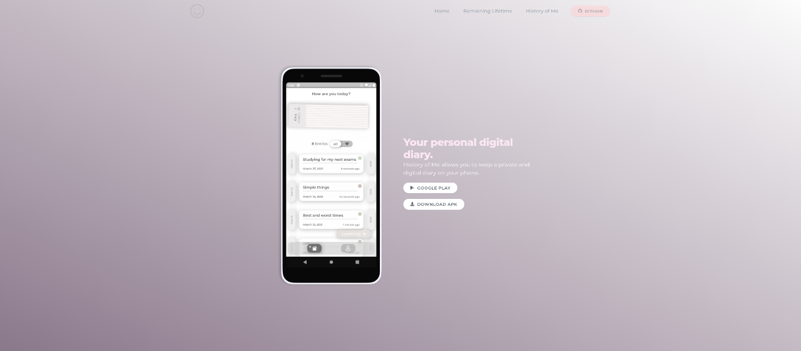

<p align="center">
  <a href="https://litlifesoftware.github.io">
    
  </a>
</p>

<h1 align="center">
  Website
</h1>

**LitLifeSoftware**'s *website* built with *Gatsby* and *React*. Its main purpose is to provide information and present apps made by LitLifeSoftware.

## Preview



Visit our *website* on [litlifesoftware.github.io](https://litlifesoftware.github.io).

## 🚀 Quick start

1.  **Checkout repository.**

    Use the Gatsby CLI ([install instructions](https://www.gatsbyjs.com/docs/tutorial/part-0/#gatsby-cli)) to create a new site, specifying the default starter.

    ```shell
    # Clone the project onto your device
    git clone https://github.com/litlifesoftware/website-gatsby.git
    ```

2.  **Start developing.**

    Navigate into your site’s directory and start it up.

    ```shell
    cd website-gatsby/
    gatsby develop
    ```

3.  **Open the source code and start editing!**

    Your site is now running at `http://localhost:8000`!

    _Note: You'll also see a second link: _`http://localhost:8000/___graphql`_. This is a tool you can use to experiment with querying your data. Learn more about using this tool in the [Gatsby tutorial](https://www.gatsbyjs.com/tutorial/part-five/#introducing-graphiql)._

    Open the `website-gatsby` directory in your code editor of choice and edit `src/pages/index.js`. Save your changes and the browser will update in real time!

## Dependencies

Our website utilizes following *node* dependencies in order to implement certain features and functions:

- [react](https://github.com/facebook/react) (Javascript Framework)
- [tailwindcss](https://github.com/tailwindlabs/tailwindcss) (CSS Framework)
- [aos](https://github.com/michalsnik/aos) (Animate on Scroll)
- [gatsby](https://github.com/gatsbyjs/gatsby) (Static Site Generator for React)
- [fortawesome](https://github.com/FortAwesome/react-fontawesome) (Icon components)
- [postcss-cli](https://github.com/postcss/postcss-cli) (Commandline Interface to compiles a CSS file based on the TailwindCSS config)

## 🎓 Learning Gatsby

Looking for more guidance? Full documentation for Gatsby lives [on the website](https://www.gatsbyjs.com/). Here are some places to start:

- **For most developers, we recommend starting with our [in-depth tutorial for creating a site with Gatsby](https://www.gatsbyjs.com/tutorial/).** It starts with zero assumptions about your level of ability and walks through every step of the process.

- **To dive straight into code samples, head [to our documentation](https://www.gatsbyjs.com/docs/).** In particular, check out the _Guides_, _API Reference_, and _Advanced Tutorials_ sections in the sidebar.
